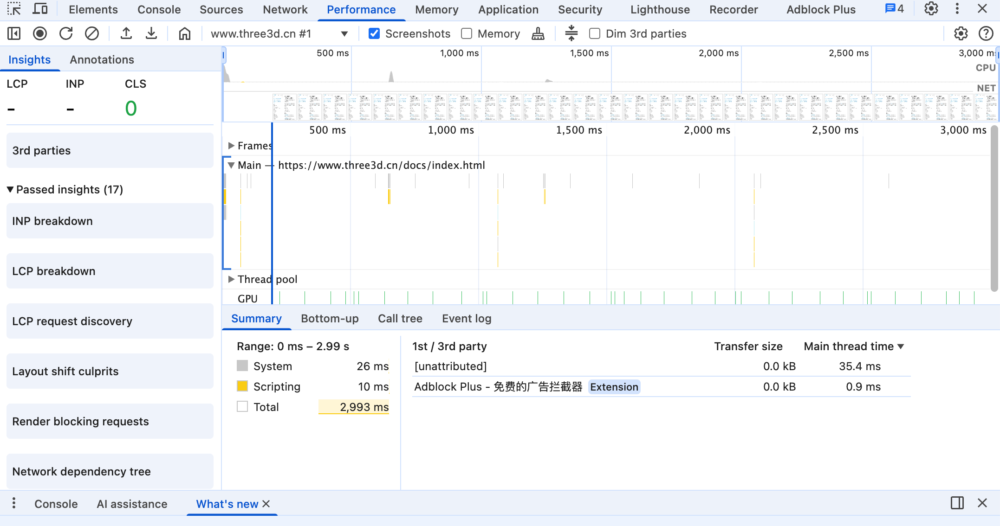

# Chrome Performance 性能分析

## 面板结构总览



## 详解

### FPS (Frames Per Second)

每秒的帧数，衡量页面的流畅度。

理想值为 60fps，即每秒钟渲染 60 次。 每帧大概是16.6ms

如果 FPS 低于 30FPS，页面就会卡顿，用户体验会下降。

如果出现红色条，那就说明帧率出现严重下降

### CPU (主线程任务)

不同的颜色代表不同的任务

- 蓝色：JavaScript 执行时间 (Scripting)
- 黄色：布局和绘制时间 (Layout)
- 绿色：HTML 解析/ DOM 构建
- 橙色：绘制(Painting)

### Network

各个网络请求中的资源加载线，以及顺序关系

### HEAP (内存)

JavaScript 堆内存使用量

上升剧烈，可能存在内存泄露

剧烈波动： 频繁的垃圾回收

## 火焰图(Flame Chart)

火焰图是性能分析的核心，展示了主线程所有任务的调用堆栈。

```
横轴 = 时间（从左到右）
纵轴 = 调用栈深度（从上到下）

每个方块 = 一个函数调用
方块宽度 = 该函数执行时长（越宽越耗时）
```

颜色/标记 含义

- 红色三角 强制同步布局（Layout thrashing）
- 红色 dotted 长时间任务（>50ms）
- 紫色条 合成层操作
- 红色竖线 DOMContentLoaded 事件
- 蓝色竖线 First Paint
- 绿色竖线 First Contentful Paint
- 紫色竖线 First Meaningful Paint

## 底部面板

### Bottom-Up

从底层函数开始排列

优势：能快速找到最耗时的叶子函数 | 最耗时的是哪块内容

### Call Tree 调用树

从顶层入口开始展开

了解函数调用路径和父子关系

可以追踪长任务和具体调用链

### Event Log 事件日志

按照事件发生的顺序排列

分析事件触发的时序关系

适合：理解事件执行顺序和依赖

## 关键事件类型详细说明

### 1. Task (长任务)

定义： 执行时间超过 50ms 的任务 ，会阻塞主线程，导致页面卡顿

常见的一些原因

- 大量js 同步执行
- 密集型计算
- 大量 DOM 操作
- 复杂选择器查询

解决方案

- 使用Web Work 处理计算密集任务
- 拆分小块任务，使用 requestIdleCallback
- 减少主线程阻塞

### 2. Parse HTML/ Parse CSS

浏览器解析 HTML 和 CSS， 通常在页面加载的早期

优化方向：

- 压缩HTML/CSS 代码
- 减少文件大小
- 并行加载资源
- 利用缓存

### 3. Recalculate Style (样式重计算)

**触发时机**

- Dom 结构变化
- CSS 样式变化
- 浏览器窗口变化 resize

**优化方向**

- 批量操作DOM
- 避免频繁的样式重计算

### 4. Layout (布局重计算)

**触发时机**

- 读取布局属性(offsetWidth, clientHeight)
- Dom 结构变化影响布局

**优化方向**

### 5. Paint (绘制)

绘制像素到图层

优化：

- 使用 transform 替代 top/left 动画
- 使用 canvas/WebGL 替代 DOM 动画
- 减少绘制区域（clip）
