# 浏览器渲染原理

## 渲染时间点
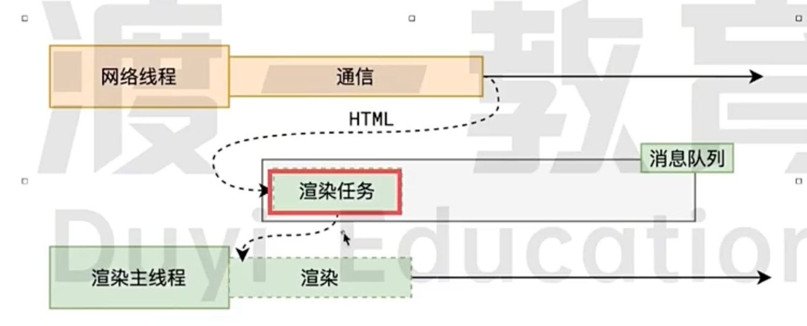

浏览器渲染页面过程简介：
当浏览器网络线程收到HTML 文档后，会产生一个渲染任务，并将其船体给渲染主线程的消息队列。

在事件循环机制的作用下，渲染主线程取出消息队列中的渲染任务，开启渲染流程。

整个渲染流程分为多个阶段： 
1. html解析
2. 样式计算
3. 布局计算
4. 分层
5. 绘制
6. 分块
7. 光栅化
8. 画

每个阶段都有明确的输入输出，上一个阶段的输出会成为下一个阶段的输入

## 第一步 解析HTML

最关键的说法 将HTML 文档转化为*DOM树*和*CSSOM树*  方便后续操作，方便js 操作这些树

### 样式表

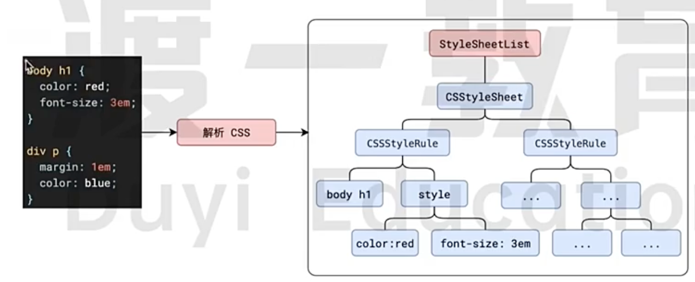

### 预解析和下载

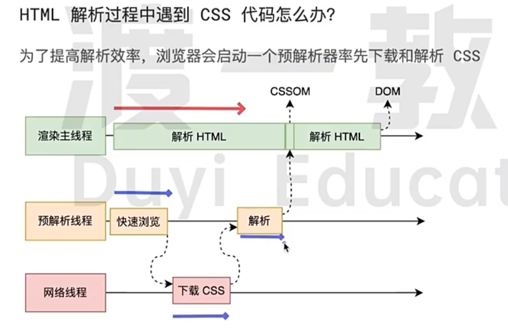

### 详解

解析过程中遇到CSS 解析CSS，遇到JS 执行JS。为了提高解析效率，浏览器在开始解析前，会启动一个预解析线程，率先下载HTML中外部CSS 文件和外部JS文件。

如果主线程解析到`link`位置，此时外部的CSS 文件还没有下载解析好，主线程不会等待，继续解析后续HTML。这是因为下载和解析CSS的工作是在预解析线程中进行的。这就是CSS不会阻塞HTML解析的根本原因。

如果主线程解析到`script`位置，会停止解析HTML，转而等待JS文件下载好，并将全局代码解析执行完成后，才能继续解析HTML。这是因为JS代码执行过程中可能会修改当前的DOM 树，所以DOM树的生成必须暂停。这就是JS 会阻塞HTML解析的根本原因。

这是第一步主要要做的事情，会得到DOM树和CSSOM树，浏览器默认样式，内部样式，外部样式，行内样式均会包含在CSSOM树中

## 样式计算

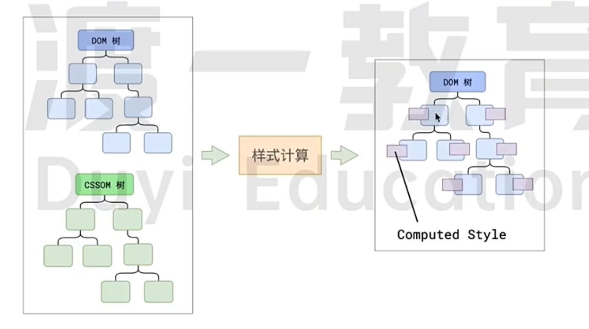

css 属性值的计算过程
 - 层叠
 - 继承

视觉格式化盒模型
 - 盒模型
 - 包含块

### 详解

主线程会遍历得到DOM树，依次为树中的每个节点计算出它的最终的样式，称之为 Computed Style。

在这一过程中，很多预设值会变成绝对值，color:red => rgb(255,0,0);相对单位变成绝对单位，比如rem 变成px

这一步完成后，会得到一颗带有样式的DOM 树

## 布局

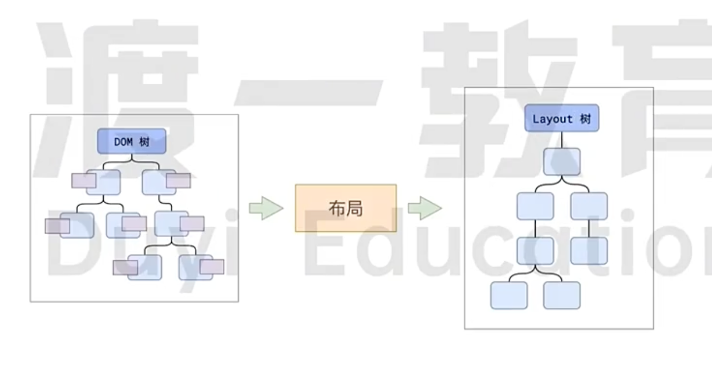

布局完成后会得到布局树

布局阶段会依次遍历DOM 树的每一个阶段，计算每个节点的几何信息。例如节点的宽高。相对包含块的位置。

大部分的时候，DOM 树和布局树并未一一对应

比如display：none 的节点没有几何信息，因此不会生成到布局树; 比如伪元素选择器，虽然dom树不存在这些伪元素节点，但它们拥有几何信息，就会被生成到布局树中。还有匿名盒、匿名块盒等等都会导致DOM树和布局树无法一一对应。

css 决定元素类型 html 只提供语义化

注意点
1. 内容必须在行盒中
2. 行盒和块盒不能相邻

获取最终计算样式 `getComputedStyle`

## 分层

主线程会使用一套嵌套的策略对整个布局树进行分层。

分层的好处在于，将来某一个层改变后，仅对该层进行后续处理，提高效率

滚动条、堆叠上下文、transform、opacity 等样式都会或多或少的影响分层结果。也可以通过will-change属性更大程度的影响分层效果。
will-change 的元素单独分层 比方说某个内容变动次数非常多，为了减少影响 可以使用will-change

## 绘制

主线程会为每个层单独产生绘制指令集，用于描述这一层的内容该如何画出来

完成绘制后，主线程将每个图层的绘制信息交给合成线程，剩余工作将由合成线程完成

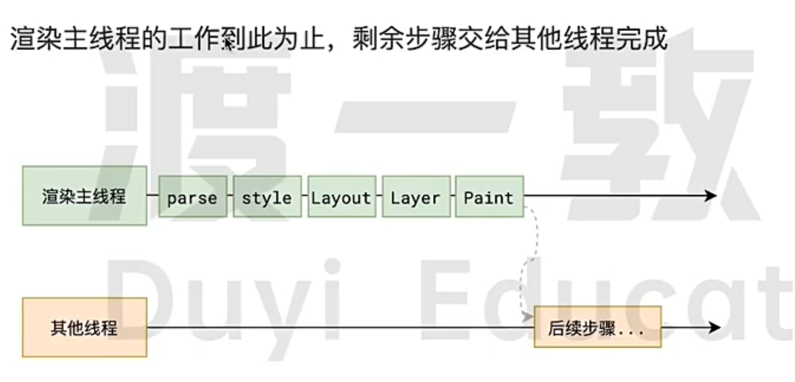

### 分块

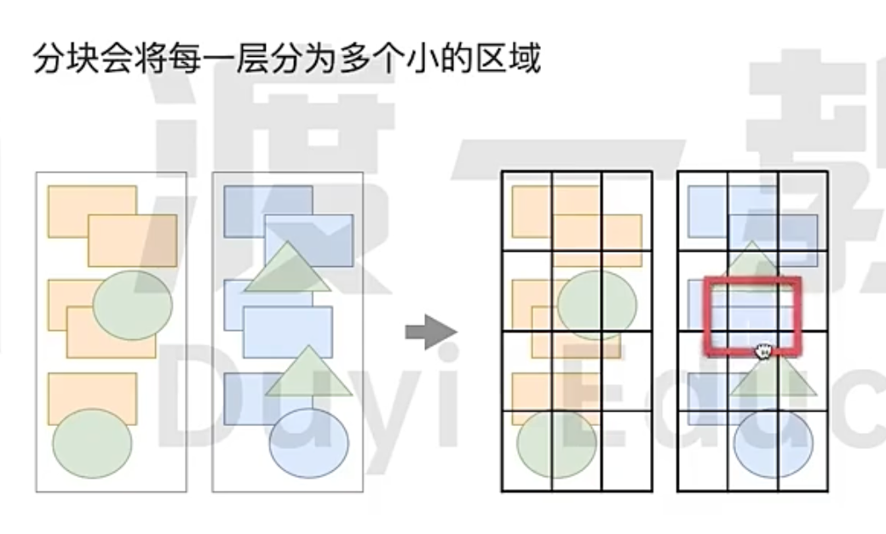

合成线程首先对每个图层进行分块，将其划分为更多的小区域

它会从线程池中拿取多个线程来完成分块工作

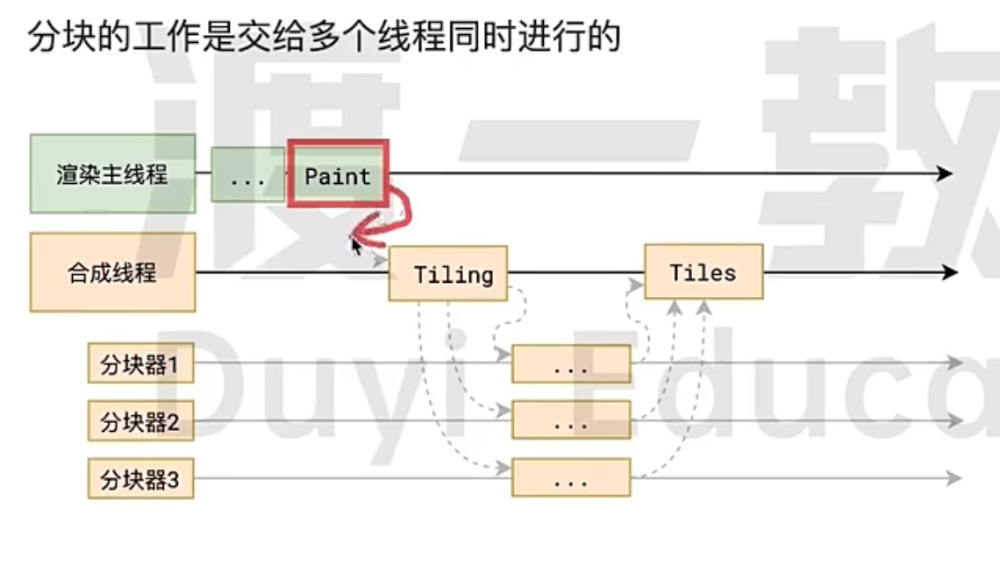

### 光栅化
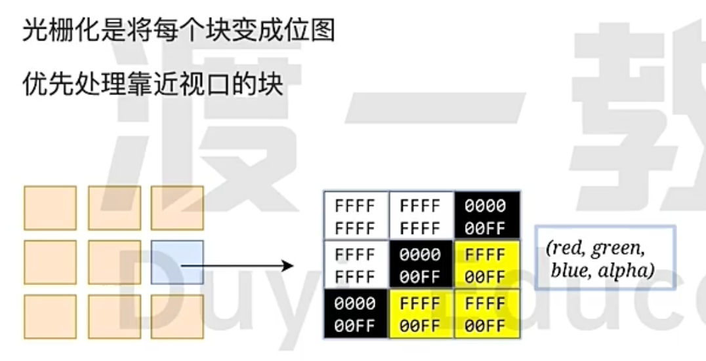
分块完成之后，进入光栅化阶段。

合成线程会将块信息交给GPU进程，以极高的速度完成光栅化。

GPU 进程会开启多个线程来完成光栅化，并且优先处理靠近视口区域的块。

光栅化的结果，就上一块一块的位图

### 画

合成线程拿到每个层每个块的位图后，生成一个个指引（quad）信息

指引会标识储每个位图应该画到屏幕的哪个位置，以及会考虑到旋转、缩放等变形。

*变形发生在合成线程，与渲染主线程无关，这就是transform效率高的本质原因。*

合成线程会把quad提交给GPU进程，由GPU进程产生系统调用，提交给GPU硬件，完成最终的屏幕成像。

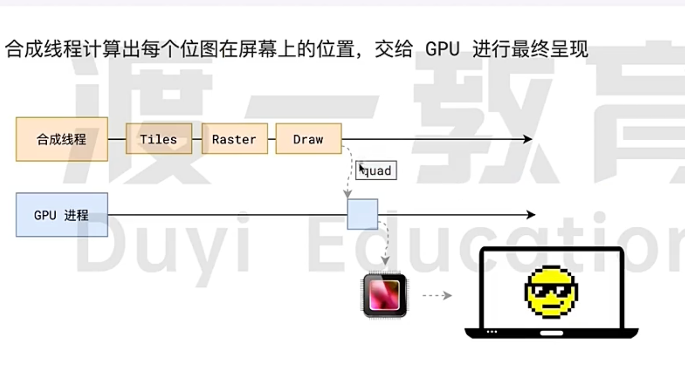

## 完整过程

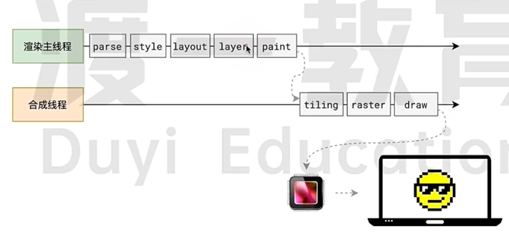

## reflow

reflow 的本质就上重新计算layout树。

当进行了会影响布局树的操作后，需要重新计算布局树，会引发layout。

为了避免连续多次操作导致布局树反复计算，浏览器会合并这些操作，当JS 代码全部完成后再进行统一计算，所以，改动属性造成的reflow是异步完成的。

也因为如此，当JS 获取布局属性时 就可能造成无法获取到最新的布局信息。

浏览器在反复权衡下，最终决定获取属性立即执行reflow 比如(**dom.clientWidth**) 

## repaint

repaint 的本质就上重新根据分层信息计算了绘制指令。

当改动了可见样式后，就需要重新计算，会引发 repaint

由于元素的布局信息也属于可见样式，所以reflow 一定会引起repaint

transform 既不会影响布局也不会影响绘制指令，他只影响渲染流程的最后一个draw 阶段。

所以它并不会影响到主线程。

