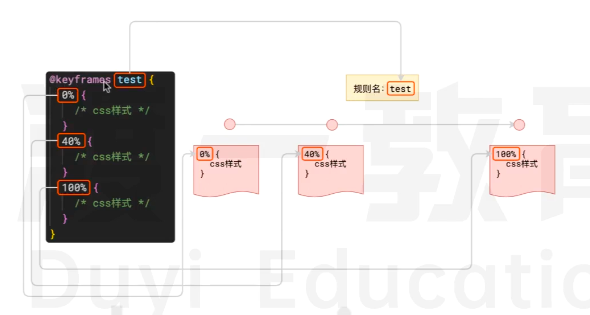

# CSS3


## CSS3视觉

### 阴影 box-shadow

#### 盒子阴影

::: normal-demo 效果展示

```html
<div class="container">
    <div class="item">
        <div class="box box1"></div>
        <p class="desc">box-shadow: 8px 15px teal</p>
        <p class="desc">
            第一个值为水平偏移量;
            第二个值为垂直偏移量;
            第三个值为阴影颜色
        </p>
    </div>
    <div class="item">
        <div class="box box2"></div>
        <p class="desc">box-shadow: -8px -15px rgba(0,0,0,0.5)</p>
        <p class="desc">
            第一个值为水平偏移量;
            第二个值为垂直偏移量;
            第三个值为阴影颜色
        </p>
    </div>
    <div class="item">
        <div class="box box3"></div>
        <p class="desc">box-shadow: 8px 15px 5px teal</p>
        <p class="desc">
            第一个值为水平偏移量;
            第二个值为垂直偏移量;
            第三个值为模糊半径；该值越大 模糊范围越大
            第四个值为阴影颜色
        </p>
    </div>
    <div class="item">
        <div class="box box4"></div>
        <p class="desc">box-shadow: 0 0 10px teal</p>
        <p class="desc">
            第一个值为水平偏移量;
            第二个值为垂直偏移量;
            第三个值为模糊半径；该值越大 模糊范围越大
            第四个值为阴影颜色
        </p>
    </div>
    <div class="item">
        <div class="box box5"></div>
        <p class="desc">box-shadow: inset 0 0 3px 8px teal;</p>
        <p class="desc">
            第一个值为向内扩散
            第二个值为水平偏移量;
            第三个值为垂直偏移量;
            第四个值为模糊半径；该值越大 模糊范围越大
            第五个值为阴影颜色
        </p>
    </div>
    <div class="item">
        <div class="box box6"></div>
        <p class="desc">box-shadow: 0 0 0 8px lightgreen, 0 0 0 16px teal;</p>
        <p class="desc">
            多个阴影，前者覆盖后者
        </p>
    </div>
</div>
```

```css
.container {
    background: #FFFFFF; height: 400px; width: 100%;
    display: flex;
    align-items: center;
    flex-wrap: wrap;
    gap: 10px;
}
.item {
    width: 250px;
}
.desc {
    margin-top: 20px;
    background: #50A14F;
}
.box {
    background: #000;
    width: 200px;
    height: 100px;
}
.box1 {
    box-shadow: 8px 15px teal;
}
.box2 {
    box-shadow: -8px -15px rgba(0,0,0,.5);
}
.box3 {
    box-shadow: 8px 15px 5px teal;
}
.box4 {
    box-shadow: 0 0 10px teal;
}
.box5 {
    box-shadow: inset 0 0 3px 8px teal;
}
.box6 {
    box-shadow: 0 0 0 8px lightgreen, 0 0 0 16px teal;
}
```

:::

#### 文字阴影

`text-shadow`:`<offset-x> <offset-y> <blur-radius>? <color>?`
 
### 圆角
`border-radius`

- `border-radius: 30px;`
- `border-radius: 25% 10%;` 当设置两个值的时候  为左上右下 | 右上左下
- `border-radius: 10% 30% 50% 70%;` 设置四个值  左上 右上 右下 左下
### 背景渐变
`linear-ground(to bottom, #e66465, #9198e5)`

- to bottom
- to right
- to top
- to left

### 变形

`transform`

#### translate 平移

- `transform: translateX(10px)` 横向平移10px
- `transform: translateY(10px)` 纵向平移10px
- `transform: translate(10px,10px)`

如果是百分比 那就是以自身宽高的比例为准

#### scale 缩放

`transform: scale(1)`

#### rotate 旋转

`transform: rotate(45deg)`
`transform: rotate(0.5turn)`

#### 改变变形原点

`transform-origin: left top`

`transform-origin: center top`

`transform-origin: right center`

`transform-origin: right bottom`

#### 多种变形叠加

可以一次性设置多种变形效果

```css
.a {
    transform:  rotate(45deg) translate(100px, 100px);
}
.b {
    transform: translate(100px, 100px) rotate(45deg);
}
```

### 过度和动画


过渡和动画无法对所有的css 属性产生影响，能够产生影响的只有数值类属性，例如：颜色，宽高字体大小等等


#### 过度

`transition: 过度属性  持续时间 过度函数 过度延迟;`

- 过度属性

    针对哪个css属性应用过度。例如填写transform， 则表示仅针对transform属性应用过度。 若填写all 或者不填写，则表示针对所有css属性都应用过渡
- 持续时间

    css 属性变化所持续的时间，需要带上单位，例如3s 0.5s 500ms
- 过渡函数
    
    本质上是css 属性变化的贝塞尔曲线函数，通常直接使用预设值：
  1. ease-in-out: 平滑开始 平滑结束
  2. linear： 线性变化
  3. ease-in：仅平滑开始
  4. ease-out： 仅平滑结束

- 过渡延迟
    
    书写规则和持续时间一样，表示过渡效果延迟多久触发，不填则无延迟

**在js中可以监听 transitionstart和transitionend 事件，从而在过渡开始和结束时做一些其他操作**


    


#### 动画

动画的本质是预先定义的一套css 变化规则，然后给该规则去个名字




然后其他元素可以使用这样的规则

`animation: 规则名 持续时间`
`animation: 规则名 持续时间 重复次数 时间函数 动画方向 延迟时间`

```css

@keyframes test {
  0% {
    width: 100px;
    height: 100px;
    background: #f40;
  }
  50% {
  width: 200px;
    height: 200px;
    background: lightgreen;
    }
  
  100% {
    width: 100px;
    height: 100px;
    background: #008c8c;
  }
}
.a {
  
}
```


