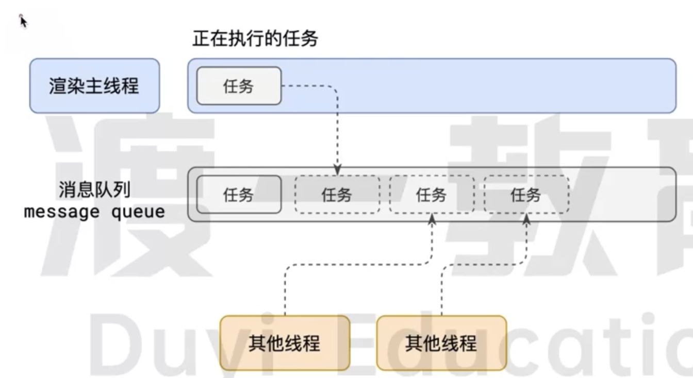
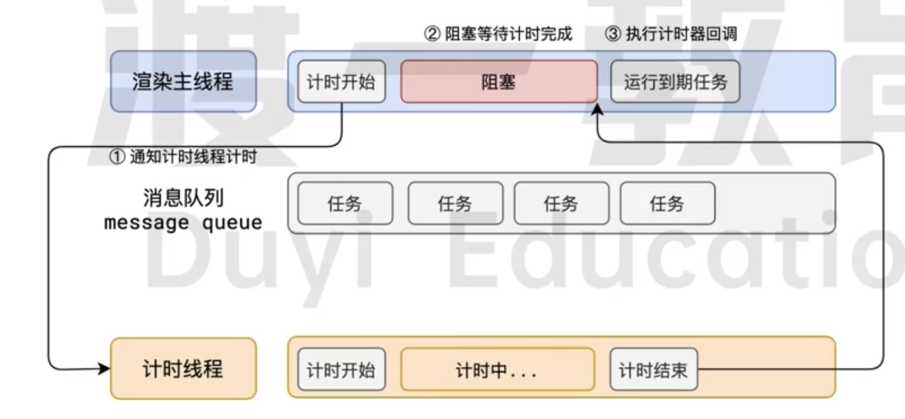

# 事件循环机制

## 什么是事件循环

JavaScript 是一门单线程、非阻塞的语言。事件循环（Event Loop）是 JavaScript 实现异步编程的核心机制，它负责协调主线程执行同步代码和管理异步任务的执行顺序。

### 为什么需要事件循环

JavaScript 只有一个主线程，同步代码会阻塞主线程。事件循环的作用是在主线程空闲时，从任务队列中取出任务执行，从而实现「非阻塞」的特性。

### 何为线程

有了进程后，就可以运行程序的代码了。

运行代码的人成为为线程。

一个进程至少有一个线程，所以在进程开启后会自动创建一个线程来运行代码，该线程称之为主线程。

如果程序需要同事执行多块代码，主线程就会启动更多的线程来执行代码，所以一个进程中可以包含多个线程。

各个线程之间互不干扰。一个崩溃了 另一个不会立刻崩溃。

### 浏览器有哪些进程和线程

1. 浏览器进程
    - 主要负责界面显示、用户交互、子进程管理等。浏览器进程内部会启动多个线程处理不同的任务。
2. 网络进程
    - 负责加载网络资源。网络进程内部会启动多个线程来处理不同的网络任务。
3. 渲染进程
   - 渲染进程启动后，会开启一个渲染主线程，主线程负责执行HTML、CSS、JS代码
   - 默认情况下，浏览器会为每个标签页开启一个新的渲染进程，以保证不同的标签页之间不会互相影响。

## 渲染主线程是如何工作的

渲染主线程是浏览器中最繁忙的线程，需要它处理的任务包括但不限于：

- 解析HTML
- 解析CSS
- 计算样式
- 布局
- 处理图层
- 每秒把页面画60次
- 执行全局js代码
- 执行事件处理函数
- 执行计时器的回调函数

要处理这么多任务，就出现了如何调度这些任务

所以就出现了排队

1. 在最开始的时候，渲染主线程会进入一个无线循环
2. 每一次循环会检查消息队列中是否会有任务存在。如果有，就取出第一任务执行，执行完一个后进入下一次循环，如果没有，则进入休眠状态。
3. 其他所有线程（包括其他进程的线程）可以随时向消息队列添加任务。新的任务会加到消息队列的末尾。在添加新任务时，如果主线程是休眠状态，则会将其唤醒以继续循环拿取任务。

这样一来，就可以让每个任务有条不紊的、持续的进行下去了。

**面试题： 如何理解JS的异步**

- js是一门单线程的语言，这是因为他运行在浏览器的渲染主线程中， 
- 而渲染主线程只有一个。而渲染主线程承担着诸多的工作、渲染页面、执行JS 都在其中运行。
- 如果使用同步的方式，极有可能导致主线程阻塞，从而导致消息队列中很多其他任务无法得到执行。
- 这样看来，一方面会导致繁忙的主线程白白的消耗时间，另一方面导致页面无法及时更新，给用户造成卡死现象。
- 所以浏览器采用异步的方式来避免，具体做法是当某些任务发生时，比如计时器，网络、事件监听，主线程将任务交给其他线程去处理，自身立即结束任务的执行，转而执行后学代码。当其他线程完成时，将事先传递的回调函数包装成任务加入到消息队列的末尾排队，等待主线程调度执行
- 在这种异步模式下，浏览器永不阻塞，从而最大限度的保证了单线程的流畅执行。

## 何为异步

在代码执行过程中，会遇到一些无法立即处理的任务，比如：
- 计时完成后需要执行的任务 setTimeout setInterval
- 网络通信完成后需要执行的任务 XHR Fetch
- 用户操作后需要执行的任务  addEventListener

如果让主线程等到这些任务的时机到达，就会导致主线程长期处于阻塞状态，从而导致浏览器卡死

**渲染主线程承担着及其重要的工作，无论如何都不能阻塞**

### 任务有优先级吗？

任务没有优先级，在消息队列中先进先出，但消息队列中有优先级

- 每个任务都有一个任务类型，同一个类型的任务必须在一个队列，不同类型的任务可以分属不同的队列，在一次事件循环中，浏览器可以根据实际情况从不同的队列中取出任务执行。
- 浏览器必须准备好一个微队列，微队列中的任务优先所有其他任务执行。

当前浏览器已经没有宏任务的说法

在当前chrome中，至少有以下队列

- 延时队列：用于存放计时器到达后的回调任务，优先级：中
- 交互队列：用于存放用户操作后产生的事件处理任务，优先级高
- 微队列： 用于存放需要最快执行的任务优先级最高 Promise MutationObserver

## 总结

- 单线程是异步产生的原因
- 事件循环是异步的实现方式
