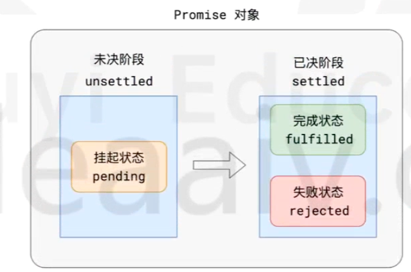
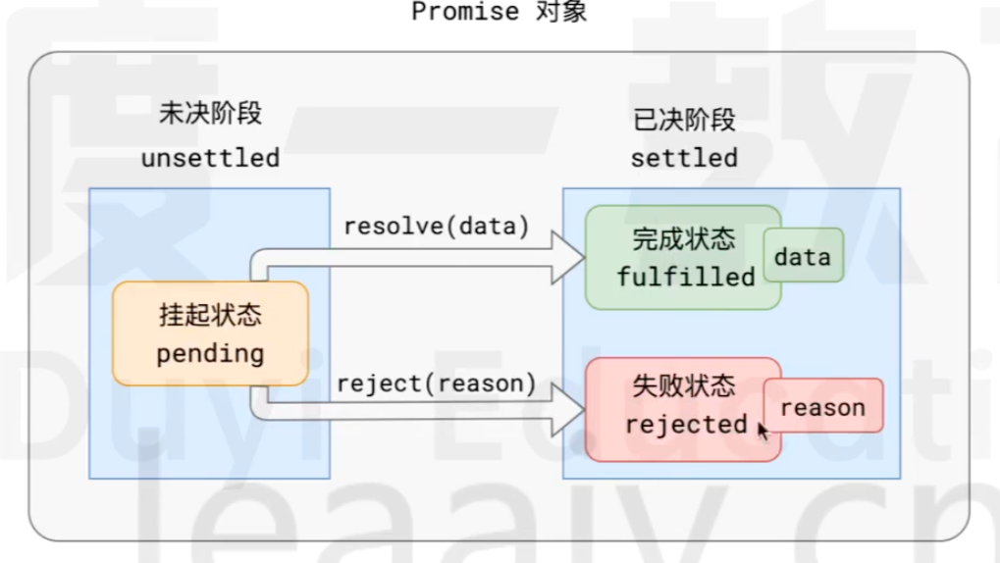
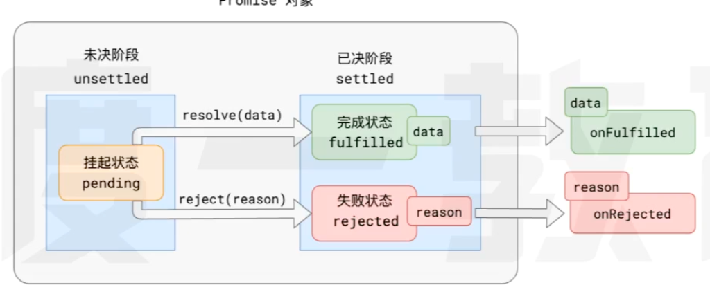
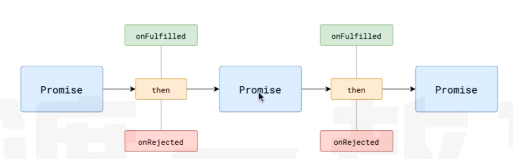

# ES2015(ES6)

## let const

var 的弊端
1. 变量提升导致的语义化问题
2. 变量提升导致的闭包问题
3. 作用域不明确
4. 可以重复定义

**出现就是为了解决var 的弊端**

1. 块级作用域
2. 先定义后使用
3. 不可重复定义

## 幂运算

```js
2**3 // 8
```

## 新增字符串API 

| API                                 | 描述           |
|-------------------------------------|--------------|
| `String.prototype.includes(s)`      | 字符串中是否包含某个子串 |
| `String.prototype.trim()`           | 去掉字符串首尾空白    |
| `String.prototype.trimEnd()`        | 去掉字符串尾空白     |
| `String.prototype.trimStart()`      | 去掉字符串首空白     |
| `String.prototype.replaceAll(s,t) ` | 将字符串所有的s替换为t |
| `String.prototype.startWith(s)`     | 判断字符串是否以s开头  |
| `String.prototype.endWith(s)`       | 判断字符串是否以s结尾  |

## 模版字符串

```js
const aa = '111'
`aaaaa${aa}`
```

## 新增数组API

`for item of xxx` 循环

| API                     | 描述                                |
|-------------------------|-----------------------------------|
| Array.isArray(array)    | 判断array是否为一个数组                    |
| Array.form(t)           | 将一个伪数组转化为真数组返回                    |
| Array.prototype.fill(t) | 将数组的某些项设置为t                       |
| forEach(fn)             | 遍历数组，传入一个函数，每次遍历运行该函数，可以改变原数组     |
| map(fn)                 | 数组映射，传入一个函数，映射数组每一项，返回一个新数组       |
| filter(fn)              | 数组筛选，传入一个函数，仅保留满足条件的内容            |
| reduce(fn)              | 数组聚合，传入一个函数，对数组的每一项按照该函数的返回聚合     |
| some(fn)                | 传入一个函数，判断数组中是否有至少一个通过该函数测试的项      |
| every(fn)               | 传入一个函数，判断数组中是否所有项通过该函数测试          |
| find(fn)                | 传入一个函数，找到数组中第一个能通过该函数测试的项         |
| includes(item)          | 判断数组中是否存在item，判断规则使用的是Object.is() |


## 对象

### 对象成员速写

```js
const name = 'aa', age = 17


// 过去
const user_old = {
    name: name,
    age: age
}
const user = {
    name,
    age
}

//过去
const myMath_old = {
    sum: function () {
        
    }
}

const myMath = {
    sum () {
        
}
}

```

### 展开运算符

```js
const arr = [1, 2,3,4,5,6]
Math.max(...arr)

const arr1 = [1, ...arr, 5]

const obj1 = {
    a: 1,
    b:2
}
const obj2 = {
    c:2,
    d:4
}

const obj3 = {
    ...obj1,
    ...obj2
}

```

### 解构

```js

const arr = [1,2,3,4,5,6]

const [a, b,c] = arr
// 取出指定下标
const [,a,,c] = arr
// 取出前两位，后面的放入新的
const [a,b, ...arr2] = arr


const user = {
    name: "aaa",
    age: 17,
    addr : {
        city: 'aaa'
    }
}

const {name, age} = user

const {
    addr: {city}
} = user
```
### 属性描述符

`Object.defineProperty(obj, propertyName, descriptor)` 修改属性描述
`Object.getOwnPropertyDescriptor ` 获取属性描述

```js
const user = {
    name: 'aa'
}

Object.defineProperty(user, 'name', {
    value: 'vvv',
    writable: false,  // 是否可更改
    enumerable: false, // 是否可枚举
    configurable: false, // 是否可再次配置
    get() {
        return 1
    },
    set(v) {
        return true
    }
})

```
### 键值对

- `Object.keys(obj)` 获取对象的属性名组成的数组
- `Object.values(obj)` 获取对象的值组成的数组
- `Object.entries(obj)` 获取对象属性名和属性值组成的数组
- `Object.fromEntries(entries)` 将属性名和属性值的数组转化为对象

```js
const user = {
    name: 'aaa',
    age: 17
}
Object.keys(user)  // [name, age]
Object.values(user) // ['aaa', 17]
Object.entries(user) // [['name', 'aaa'], [..]]
Object.fromEntries([['name', 'aaa']])  // {name: 'aaa'}

```

### 冻结

`Object.freeza(Obj)`

可以冻结一个对象，该对象的所有属性均不可更改  浅层冻结 相当月vue3 shallow

可以使用`Object.isFrozen(Obj)` 来判断一个对象是否被冻结

### 相同性判断 `Object.is`

可以判断像个值是否相同  它和 `===` 的功能基本一致，区别在于

- NaN 和NaN 相等
- +0 和 -0 不相等

### [Set](https://developer.mozilla.org/zh-CN/docs/Web/JavaScript/Reference/Global_Objects/Set)

Set是一种数据集合 用于保存一系列唯一的值

 - add
 - delete
 - has
 - entries  `[value, value]`
 - forEach
 - values 返回一个迭代器

### [Map](https://developer.mozilla.org/zh-CN/docs/Web/JavaScript/Reference/Global_Objects/Map)

Map是一种数据集合，用于保存一些列键值对`（key - value） key `是唯一的

- clear
- delete
- entries
- forEach
- get
- set
- has
- keys
- values
- size

## 函数

### 箭头函数

所有使用函数表达式的位置，均可以替换为箭头函数

```js
const fun1 = () => {}

const fun2 = () => a
```

1. 不能使用new 调用
2. 没有原型， 即没有prototype
3. 没有arguments
4. 没有this  在里面用this 会向上寻找

### 剩余参数

ES6 不建议在使用 arguments 来获取参数列表，他推荐使用剩余参数来收集未知数量的参数
```js
function method(a,b, ...args) { // args 是数组
    
}

method(1,2,3,4,5)  // args [3,4,5]
```

### 参数默认值

```js
function fun1 (a = 1) {
    
}
```

### 类语法 class

过去，函数有着两种调用方式

```js

function A () {
    
}
A()  //直接调用
new A() //作为构造函数调用
```

这种做法无法定义上明确函数的用途，因此，ES6退出了一种全新的语法来书写构造函数

```js
function User(firstName, lastName) {
    this.firstName = firstName
    this.lastName = lastName
    this.fullName = `${firstName} ${lastName}`
}

User.isUser = function (u) {
    return !!u
}

User.prototype.sayHello = function () {
    console.log(this.fullName)
}

// 改变后

class User_ {
    firstName;
    lastName
    constructor(firstName, lastName) {
        this.firstName = firstName
        this.lastName = lastName
    }
    
    static isUser () {
        //
    }
    
    sayHello () {
        
    }
}

```

**继承**

```javascript
function Animal(type, name) {
    this.type = type
    this.name = name
}

Animal.prototype.intro = function (){
    //
}

function Dog(name) {
    Animal.call(this, 'dou', name)
}
Dog.prototype = Object.create(Animal.prototype)


// 新的方式

class Animal1 {
    constructor(type, name) {
        this.type = type
        this.name = name
    }
    
    intro () {
        console.log()
    }
}

class dog  extends Animal1 {
    constructor (name) {
        super('gou', name)
    }
}

```
### 函数API 


| API                                   | 描述                               |
|---------------------------------------|----------------------------------|
| Function.prototype.call(obj, ...args) | 调用函数，绑定this为obj , 后续以列表形式提供参数    |
| Function.prototype.apply(obj, args)   | 调用函数，绑定this为obj，后续参数以数组形式提供      |
| Function.prototype.bind(obj, ...args) | 返回一个函数的拷贝，新函数的this为obj，起始参数为args |


## 异步

### Promise

背景： 解决历史异步处理方式的回调地狱

```javascript
function promise (message, fullfiled, rejected) {
    setTimeout(() => {
        if (message) {
            fullfiled(message)
        }else {
            rejected(message)
        }
    }, 500)
}

promise('aaa', (message) => {
    console.log(message)
}, (message) => {
    promise('bbb', (message) => {
        console.log(message) 
    }, (message) => {
        // 
    })
})
```

在链式调用的过程中需要不停在回调中写后续代码，整个代码就会很丑


### Promise规范

PromiseA+ 规定

1. 所有的一部场景，都可以看做是一个一部任务，每个异步任务，在JS中应该表现为一个对象，该对象称之为Promise对象，也叫做任务对象
2. 每个任务对象，都应该有两个阶段、三个状态
   
    根据常理。他们之间存在以下逻辑
    - 任务总是从觉决阶段变道已决阶段，无法逆行
    - 任务总是从挂起状态变到完成或者失败状态，无法逆行
    - 事件不能倒流，历史不可改写，任务一旦完成或失败，状态就固定下来，永远无法改变
3. 挂起->完成， 称之为resolve； 挂起->失败称之为reject。任务完成时，可能有一个相关数据，任务失败时，可能有一个失败原因
   
4. 可以针对任务进行后续处理，针对完成状态的后续处理称之为onFulfilled，只针对失败的后续处理称之为onRejected
   

### Promise Api

```javascript
new Promise((resolve, reject) => {
    
}).then().catch()
```

- then
- catch

### 链式调用



1. then 方法必定返回一个新的Promise 可以理解为 后续处理的任务也是一个任务
2. 新任务的状态取决于后续处理：
   - 如果没有后续的处理，新任务的状态和钱任务一致，数据为前任务的数据
   - 若后续处理但还未执行，新任务挂起。
   - 若后续处理执行了，则根据后续处理的情况确定新任务的状态
     - 后续处理执行无错，新任务的状态为完成，数据为后续处理的返回值
     - 后续处理执行有错，新任务的状态为失败，数据为异常对象
     - 后续执行后返回的是一个任务对象，新任务的状态和数据域该任务一致

```javascript
const pro = new Promise()
pro.then(() => {
    
}).then(() => {
    
})
```

### 静态方法
| API                      | 描述                           |
|--------------------------|------------------------------|
| Promise.resolve(data)    | 直接返回一个完成状态的任务                |
| Promise.reject(reson)    | 直接返回一个拒绝状态的任务                |
| Promise.all(任务数组)        | 返回一个任务，任务数组都成功则成功，一个失败就失败    |
| Promise.any(任务数组)        | 返回一个任务，任务数组任意成功则成功，任务都失败就是失败 |
| Promise.allSettled(任务数组) | 返回一个任务，任务数组全部抉择完就成功，该任务不会失败  |
| Promise.race(任务数组)       | 返回一个任务，任务数组任意已抉择，状态和其一致      |
