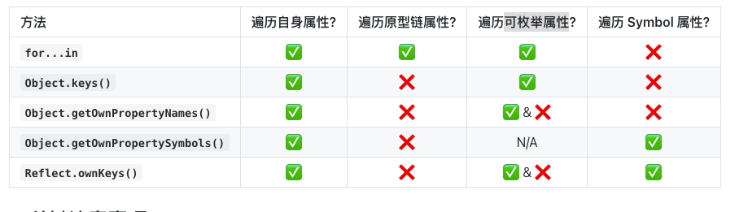

### 理解Typeof 陷阱
在进行类型判断的时候 typeof 是最常用的工具之一，但它并非没有问题
1. 避免错误的类型判断 尤其在处理null 的时候
2. 编写更为健壮的代码

Api 用法

```ts
// 原始类型
console.log(typeof 'hello');      // "string"
console.log(typeof 123);          // "number"
console.log(typeof true);         // "boolean"
console.log(typeof Symbol('id')); // "symbol"
console.log(typeof 123n);         // "bigint"
console.log(typeof undefined);    // "undefined"

// 对象类型
console.log(typeof { a: 1 });     // "object"
console.log(typeof [1, 2, 3]);    // "object" (陷阱)
console.log(typeof new Date());   // "object"

// 函数
console.log(typeof function() {});// "function" (特殊的对象)
```

1. typeof null === 'object'  历史遗留的bug
2. typeof [] 和 typeof {} 的结果无法区分

更加精确的类型检测： Object.prototype.toString.call(null)

```ts
Array.from()
Object.prototype.toString.call('');      // "[object String]"
Object.prototype.toString.call(1);       // "[object Number]"
Object.prototype.toString.call(null);    // "[object Null]"
Object.prototype.toString.call([]);      // "[object Array]"
Object.prototype.toString.call({});      // "[object Object]"
```

### 对象遍历方式


###  Call apply bind 的核心原理

#### 核心概念
call、apply 和bind 是JavaScript中Function.prototype 对象上的三个方法，主要用于控制函数执行的上下文（即this的指向）。他们允许开发者显示更改函数内部的this指向。
#### 为什么需要
1. 解决this 指向的动态性/不确定性： 在JavaScript中this的值取决于函数被调用的方式（全局调用，对象方法调用、构造函数调用、事件处理函数等），当原本的this 不是我们期望的对象，我们可以使用call、apply 或 bind 来显式指定this的值。
2. 函数参数的处理：call apply 在传递参数的方式上略有不同，提供了灵活的参数传递机制。


### 跨域 cors
主要是服务器为主 前端给发送源 ，后端告诉前端浏览器 这是不是可信任的

简单请求  不改变header get post head

复杂请求需要发送预见请求，预检回来会有一个max-age 能够告诉浏览器多少时间内不需要在重新预见

### SEO 搜索引擎深度优化

1. 页面结构优化 HTML 5  语义化标签  meta  描述标签
2. 内容优化
   保证页面上的关键词覆盖率
3. 技术向 SEO 优化
   1. 站点地图 告诉爬虫什么是能看 什么不能看
   2. 结构化数据
    ```html
    <script type="application/ld+json">
    {
    "@context": "https://schema.org",
    "@author":  "aaaa",
    "@type": "Person",
    "name": "John Doe",
    "url": "https://example.com",
    "sameAs": "https://example.com/john-doe",
    "mainEntityOfPage": {
    "@type": "WebPage",
    "@id": "https://example.com",
    "name": "John Doe",
    }
    </script>
    ```
   3. 移动端兼容


###  服务端渲染 SSR
SPA 缺点  渲染过程在客户端 爬虫拿到的只是一个html 的空壳

不利于SEO  

#### SSR 优点
1. 提升首屏加载速度
2. 优化SEO 
3. 能够提前显示预览内容


#### SSR 缺点

1. 增加开发复杂度，服务器需要处理渲染逻辑，涉及nodejs
2. 服务器压力增大
3. 状态管理复杂

应用场景

1. 官网
2. 门户网
3. 广告


### 有了解过服务端渲染吗  说说核心概念
Vue + Nuxt.js

更加方便去做SEO 优化