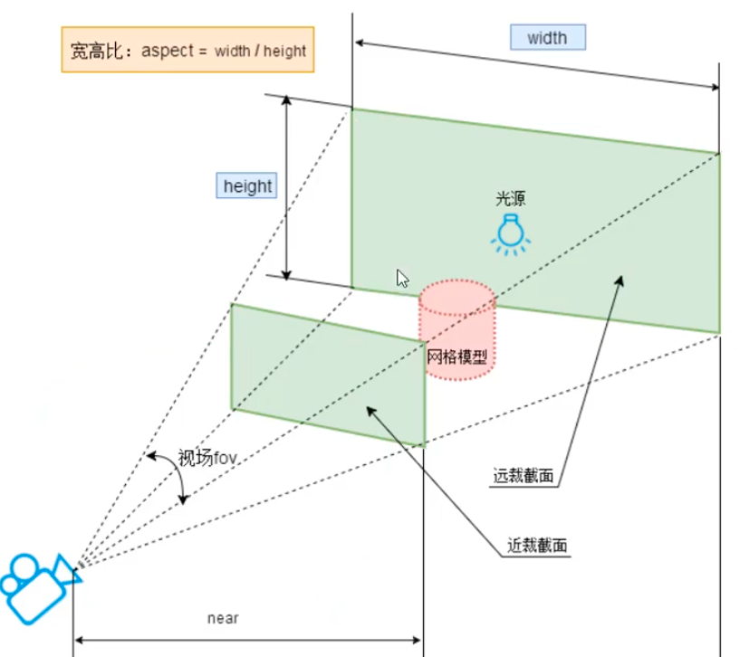

# Camera

## PerspectiveCamera(透视相机)

相当于人的眼睛，物体离相机越远看起来越小，离相机越近看起来越大

`const camera = new THREE.PerspectiveCamera(fov, aspect, near, far)`

- fov: 视野范围，单位是度 越大 看到的越多
- aspect: 宽高比，通常是窗口的宽高比
- near: 近裁剪面，距离相机多远的物体开始被渲染
- far: 远裁剪面，距离相机多远的物体开始被裁剪掉



```javascript
const camera = new THREE.PerspectiveCamera(75, window.innerWidth / window.innerHeight, 0.1, 1000);
```

## CameraHelper(相机辅助)

`CameraHelper` 可以帮助我们可视化相机的视锥体，方便我们调整相机的位置和参数。

```javascript
const cameraHelper = new THREE.CameraHelper(camera);
scene.add(cameraHelper);
``` 