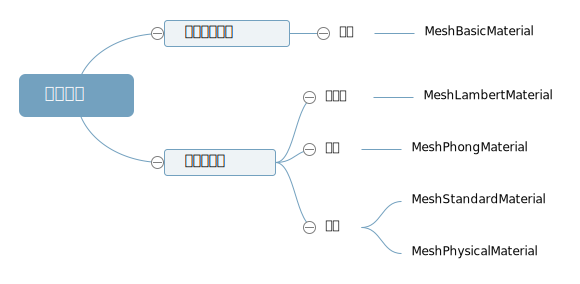
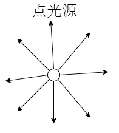
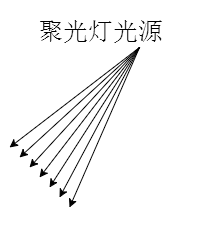
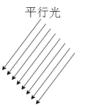

# Light(光源)

**受光照影响的材质**

## AmbientLight(环境光)
环境光是均匀照亮场景的光源，不会产生阴影，适合用来模拟室内或户外的自然光。
环境光不能用来投射阴影，因为它没有特定的方向和位置。

`const ambientLight = new THREE.AmbientLight(0xffffff, 0.5); // 第二个参数是光的强度，默认值为1`
`scene.add(ambientLight);`

## PointLight(点光源)
类似灯泡， 向四周发散光线，距离越远光线越暗

**光源衰减**
`pointLight.decay = 2`  默认值为1，数值越大衰减越快 0为不衰减

**光源位置**
`pointLight.position.set(0, 0, 0)`

**添加光源**
`scene.add(pointLight)`

### 点光源辅助侦查（PointLightHelper）

`const pointLightHelper = new THREE.PointLightHelper(pointLight, 0.5); // 第二个参数是辅助侦查的大小`
`scene.add(pointLightHelper);`

## SpotLight(聚光灯)

## DirectionalLight(平行光)
平行光就是沿着特定反向发射

`const directionalLight = new THREE.DirectionalLight(0xffffff, 1);`
`directionalLight.position.set(0, 1, 0); // 设置光源位置`
`directionalLight.target.position.set(0, 0, 0); // 设置光源的目标位置 可以设置目标为mesh`
`scene.add(directionalLight);`

### 平行光辅助观察（DirectionalLightHelper）
`const directionalLightHelper = new THREE.DirectionalLightHelper(directionalLight, 0.5); // 第二个参数是辅助侦查的大小`
`scene.add(directionalLightHelper);`

### 平行光阴影计算

1. .castShadow 设置产生阴影的模型对象和光源对象
2. .receiveShadow 设置接收阴影效果的模型
3. .shadowMap.enabled WebGl 渲染器允许阴影渲染
4. .shadow.camera 设置光源阴影渲染范围